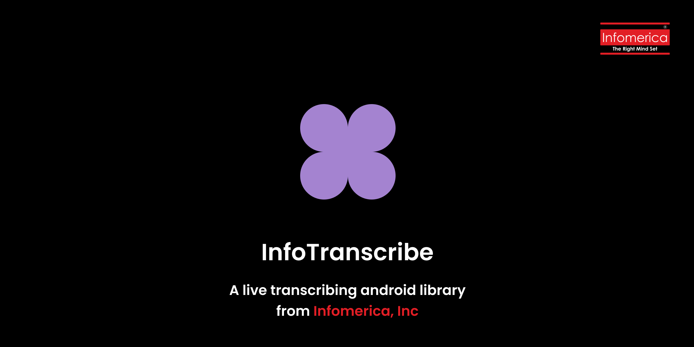

# Introducing you InfoTranscribe

<p align="center">
  
</p>

An extended version of the [Azure SDK for Android](https://github.com/Azure/azure-sdk-for-android), adding enhanced functionality tailored for modern Android development. Supports coroutines, Jetpack libraries.

---

## 📱 Demo

Here’s a quick look at what this SDK can do:


---

## 🛠 Features

- 🔐 Easy integration with Jetpack.
- ⚡ Supports multiple streamed responses.
- 🧩 More control over the sdk.

---

## 📦 Installation

### Kotlin DSL

Add this to your `settings.gradle.kts`:

```groovy
	dependencyResolutionManagement {
		repositoriesMode.set(RepositoriesMode.FAIL_ON_PROJECT_REPOS)
		repositories {
			mavenCentral()
			maven { url = uri("https://jitpack.io") }
		}
	}
```

Add this to your `build.gradle.kts`

## Lastest Version 
[](https://jitpack.io/#info-coe/InfoTranscribe)

```groovy
dependencies {
  implementation("com.github.info-coe:InfoTranscribe:vLASTEST_VERSION")
}
```

> [!NOTE]
> Make sure to include `v` along with the version number.
> Example `v1.0.0`


## Requirments
- Minimum sdk : 24
- Compile sdk : 35

