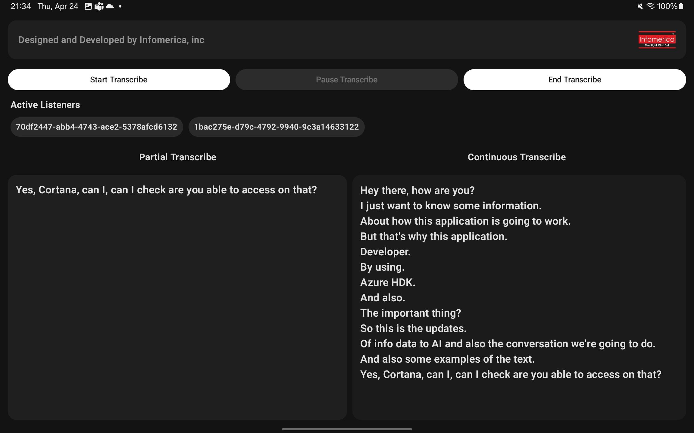

# Introducing you InfoTranscribe

<p align="center">
  
</p>

An extended version of the [Azure SDK for Android](https://github.com/Azure/azure-sdk-for-android), adding enhanced functionality tailored for modern Android development. Supports coroutines, Jetpack libraries.

---
&nbsp;
## 📱 Demo

Here’s a quick look at what this SDK can do:


<p align="center">
  
</p>

And this is the preview


&nbsp;

## 🛠 Features

- 📦 Easy integration with Jetpack
- 🔁 Supports multiple streamed responses
- 🧶 Built-in coroutine support
- 🪶 Lightweight — only 53 KB
- 🎛️ More control over the SDK
- 🛡️ Inbuilt permission validations

&nbsp;
## Project Requirments
- Minimum sdk : 24
- Compile sdk : 35
> [!WARNING]
> Make sure to set your compile sdk version to `35` else the project will not going to build.

&nbsp;
## Azure sdk Requirments
The libraries are written in Java 8. Your application must be built with Android Gradle Plugin 3.0.0 or later, and must be configured to enable Java 8 language desugaring to use these libraries. Any Java 8+ APIs that would require the Java 8+ API desugaring provided by Android Gradle plugin 4.0.0 are not used.

## To use this sdk you must have
- [Azure subscription](https://azure.microsoft.com/en-us/pricing/purchase-options/azure-account?icid=azurefreeaccount)

&nbsp;
## 📦 Installation

### Kotlin DSL

Add this to your `settings.gradle.kts`:

```groovy
	dependencyResolutionManagement {
		repositoriesMode.set(RepositoriesMode.FAIL_ON_PROJECT_REPOS)
		repositories {
			mavenCentral()
			maven { url = uri("https://jitpack.io") }
		}
	}
```

Add this to your `build.gradle.kts`

&nbsp;
## Lastest Version 
[](https://jitpack.io/#info-coe/InfoTranscribe)

```groovy
dependencies {
  implementation("com.github.info-coe:InfoTranscribe:vLASTEST_VERSION")
}
```

> [!NOTE]
> Make sure to include `v` along with the version number.
> Example `v1.0.0`


&nbsp;
## How to use InfoTranscribe!
Once the gradle build is done, You are good to go. Now add this piece of code in your 
`Application` class

&nbsp;
- ### Initializing the InfoTranscribe
By doing this you can create a singleton instace of infoTranscribe accros you application lifecycle, So you can use
it later in your composables.
```kotlin
class InfoTranscribeApplication : Application() {
    override fun onCreate() {
        super.onCreate()

        //Creates an instance of InfoTranscribe
        InfoTranscribe.initialize(
            this,
            Constants.AZURE_API_KEY,
            Constants.AZURE_REGION
        )
    }
}
```

&nbsp;
- ### Updating the apikeys
This sdk is built upon the [Azure SDK for Android](https://github.com/Azure/azure-sdk-for-android) we need to get the api keys
from microsoft azure.
```Kotlin
object Constants {
    private const val DUMMY_KEY = "DUMMY_KEY"
    private const val DUMMY_REGION = "DUMMY_REGION"

    //Replace with your actual key and region
    const val AZURE_API_KEY = DUMMY_KEY
    const val AZURE_REGION = DUMMY_REGION
}
```
&nbsp;
- ### Adding InfoTranscribe instance to your composable
By calling the `InfoTranscribe.getInstance()` we can able to get the instance of `InfoTranscribe` in our
composable.
```kotlin
@Composable
fun LiveTranscribeExample(
    paddingValues: PaddingValues
) {

    val isPreview = LocalInspectionMode.current

    /**
     * Some of the classes are not available
     * in preview, So passing null as instance
     * for the previews.
     */
    val infoTranscribe = remember {
        if (isPreview) {
            null
        } else {
            InfoTranscribe.getTranscribe()
        }
    }
}
```

&nbsp;
- ### Adding the observation listeners to our composable
By adding the listeners we can able to observe the transcribed text from the
InfoTranscribe,
Currently InfoTranscribe support
- Partial Reponses
- Continous Responses

You can add listeners based on your needs there is no limit for the listeners.

```Kotlin
infoTranscribe?.apply {

   // By adding we can see only the latest transcribed text.
    addOnObserveListener(
        responseType = ResponseType.Partial
    ) { output ->
        result1 = output
    }

   // By adding we can see the latest transcribed text combined with pervious.
    addOnObserveListener(
        responseType = ResponseType.Continuous
    ) { output ->
        result2 = output
    }
}
```

&nbsp;
- ### Adding the error listeners to our composable
By adding the error listeners we can able to observe errors in one place, to do that
```Kotlin
//Add the error listeners to the current instance.
infoTranscribe?.addOnErrorListener {
    currentError = it
}
```

&nbsp;
- ### Starting the transcribe
For starting the transcribe in the composable
```Kotlin
        Button(
            onClick = {
                infoTranscribe?.startTranscribe()
            },
            modifier = Modifier
                .weight(.5f),
            enabled = isTranscribing.not()
        ) {
            Text(text = "Start Transcribe")
        }
```

&nbsp;
- ### Pausing the transcribe
For pausing the transcribe in the composable
```Kotlin
       Button(
                onClick = {
                    infoTranscribe?.pauseTranscribe()
                },
                modifier = Modifier
                    .weight(.5f),
                enabled = isTranscribing
            ) {
                Text(text = "Pause Transcribe")
            }
```

&nbsp;
- ### Ending the transcribe
For ending the transcribe in the composable
```Kotlin
            Button(
                onClick = {
                    infoTranscribe?.removeActiveListeners()
                    infoTranscribe?.endTranscribe()
                    listeners.clear()
                },
                modifier = Modifier
                    .weight(.5f),
                enabled = isTranscribing.not() && isTranscribeActive
            ) {
                Text(text = "End Transcribe")
            }

```

&nbsp;
- ### Now Let's put all thing together
Refer the [LiveTranscribeExample.kt](app/src/main/java/com/infomericainc/infotranscribe/LiveTranscribeExample.kt) for complete implementation.
